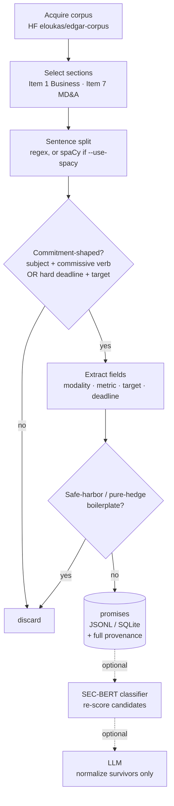

# Corporate Promise Extractor

Local, LLM-free extraction of corporate **promises** — forward-looking commitments
("we will… by 20XX", "we are committed to reducing… by N%") — from a large EDGAR
corpus. The output is one structured, provenance-tagged record per commitment,
designed to feed a longitudinal "was the promise kept?" tracker downstream.

No LLM is required to start. Forward-looking commitments are linguistically
regular, so a rule-based pass yields high-precision candidates with full
provenance. An LLM (or a fine-tuned classifier) is an optional later stage, used
to *normalize* survivors — never to *find* them.

---

## Quick start

The extractor lives at [src/extract_promises.py](src/extract_promises.py). Run it
directly with `python3 src/extract_promises.py …`, or use the `run.sh` / `run.ps1`
wrappers, which forward every argument to the extractor so the commands below work
verbatim (just swap `python3 extract_promises.py` → `./run.sh`).

```bash
# 0. (optional) isolate deps
python3 -m venv .venv && source .venv/bin/activate

# 1. offline smoke test: demo + extraction over the bundled sample corpus
./run.sh                       # Windows: .\run.ps1

# 1b. just the built-in samples (no data, no network)
python3 src/extract_promises.py --demo

# 2. install the corpus loader
pip install -r requirements.txt        # or: pip install datasets

# 3. run over one year of 10-K filings
python3 src/extract_promises.py \
  --source hf:eloukas/edgar-corpus --year 2020 \
  --sections section_1 section_7 \
  --out output/promises_2020.jsonl --min-score 5
```

The repo ships a tiny synthetic corpus, [data/sample_rows.jsonl](data/sample_rows.jsonl),
so the local pipeline (and `run.sh` with no args) works with no network or optional
deps. Dependencies are all optional and listed in
[requirements.txt](requirements.txt) — the extractor itself runs on the standard
library alone:

```
datasets         # corpus loading from Hugging Face
pyarrow          # only for --source parquet:
huggingface_hub  # only for Option B (huggingface-cli download)
spacy            # only for --use-spacy (NER for dates/quantities)
```

---

## 1. Acquiring the data

The default corpus is **`eloukas/edgar-corpus`** on Hugging Face: every public
company's Form 10-K, **1993–2020**, already split into the item sections we care
about (Item 1 Business, Item 1A Risk Factors, Item 7 MD&A, …), licensed Apache-2.0.
Pre-sectioning matters — commitments concentrate in Item 1 and Item 7, while
Item 1A is mostly hedged "may/could" language we want to skip.

### Option A — download the corpus into `./data` (recommended)

`eloukas/edgar-corpus` ships a dataset *loading script* (`edgar-corpus.py`), and
recent `datasets` releases dropped `trust_remote_code`, so
`--source hf:eloukas/edgar-corpus` **no longer works** (you'll get
*"Dataset scripts are no longer supported"*). Instead, download the Hub's
auto-converted **Parquet** copy and point the extractor at the files:

```bash
pip install huggingface_hub pyarrow

# one year, train split -> data/edgar-corpus/year_2020/train/*.parquet
python3 src/download_corpus.py --year 2020

# quick test: grab a single shard first
python3 src/download_corpus.py --year 2020 --split validation --max-files 1

# then extract:
python3 src/extract_promises.py \
  --source parquet:data/edgar-corpus/year_2020/train \
  --out output/promises_2020.jsonl --min-score 5
```

The download lands under `./data` (git-ignored except the bundled
`sample_rows.jsonl`). [download_corpus.py](src/download_corpus.py) accepts
`--year`, `--split {train,validation,test}`, `--max-files N`, and `--repo`.

> **Why not `--source hf:`?** The old script-based loader is unmaintained.
> `download_corpus.py` reads the same data from the Hub's `refs/convert/parquet`
> revision, which needs no remote code.

### Option B — any other parquet corpus

The `parquet:` source reads any directory of `.parquet` files. Rows with
`section_*` columns are scanned per section; rows with only a `text`/`section_full`
column are scanned whole. For example **`PleIAs/SEC`** (10-Ks 1993–2024, full text,
no loading script):

```bash
huggingface-cli download PleIAs/SEC --repo-type dataset --local-dir ./data/pleias
python3 src/extract_promises.py --source parquet:./data/pleias --sections section_full ...
```

Scanning whole-document text (Option B) is noisier than the pre-sectioned corpus
(Option A) because you also sweep risk factors and legal boilerplate — the
safe-harbor filter handles most of it, but expect lower precision.

### Sizing & scope

- A **single year** is a few GB; the **full 1993–2020** set is tens of GB. Start
  with one year, validate precision, then widen with `--year` or the `full` config.
- This corpus yields **financial / operational / governance** promises (capex,
  store openings, buybacks, margin targets, hiring). **ESG / climate** pledges
  mostly live in standalone sustainability reports, not 10-Ks — see *Extending
  the corpus*.

### Fresh filings beyond 2020 (official SEC, free, self-hosted)

The SEC's own access is free with no key — sidestep rate limits by pulling the
nightly bulk archives and hosting them yourself:

- `https://www.sec.gov/Archives/edgar/daily-index/xbrl/companyfacts.zip` — all XBRL facts
- `https://www.sec.gov/Archives/edgar/daily-index/xbrl/submissions.zip` — all filing histories
- `https://www.sec.gov/Archives/edgar/full-index/{YYYY}/QTR{1-4}/master.idx` — filing index

Live requests are limited to **10 req/s** and **require a descriptive
`User-Agent` header** (e.g. `Spare Energy research@example.com`) or the SEC
returns 403. To get item sections from raw filings, run them through
[`edgar-crawler`](https://github.com/lefterisloukas/edgar-crawler) (the same
toolkit that produced `eloukas/edgar-corpus`), then feed its JSON to this script.

### Extending the corpus (ESG / open web)

| Source | What it gives you | Coverage | Access | License |
|---|---|---|---|---|
| `eloukas/edgar-corpus` (HF) | 10-K item sections | 1993–2020 | `datasets` | Apache-2.0 |
| `PleIAs/SEC` (HF) | 10-K full text (parquet) | 1993–2024 | `hf download` | see card |
| SEC EDGAR bulk | all filings + XBRL | 1993–present | free, 10 req/s | US public domain |
| ResponsibilityReports / SustainabilityReports | CSR/ESG report PDFs | 2000–present | free download | site terms |
| Common Crawl | open-web pages (company sites) | 2008–present | free (AWS S3) | CC terms |
| Net Zero Tracker (via Our World in Data) | structured net-zero targets | current | CSV | CC BY |
| WikiRate | ESG commitments + linked outcomes | current | REST API | CC BY 4.0 |

For ESG promises, parse sustainability-report PDFs (e.g. with the report
archives or Common Crawl) to plain text and feed them to the **same extractor**
via `--source jsonl:` or `--source parquet:`, mapping each report to a
`section_*` field.

---

## 2. The processing flow



1. **Acquire** — one year of the corpus, or local `jsonl`/`parquet`.
2. **Select sections** — scan Item 1 and Item 7; skip Item 1A (hedged noise).
3. **Split + cheap prefilter** — sentence-split, then keep only
   commitment-shaped sentences (corporate subject + commissive verb, *or* a hard
   "by 20XX" deadline plus a quantified target). Nothing expensive runs on the rest.
4. **Extract fields** — modality, metric category, target value(s), deadline
   year, the verbatim span, a stable `promise_id`, and a heuristic score.
5. **Filter boilerplate** — drop forward-looking-statement / safe-harbor
   disclaimers and pure-hedge sentences. These are the dominant false-positive
   sources; handling them explicitly is what makes the pass precision-first.
6. **Emit** — JSONL or SQLite, one row per candidate with full provenance.

---

## 3. Usage

```
--source     hf:NAME | jsonl:PATH | parquet:PATH_OR_DIR   (required unless --demo)
--year       corpus year, e.g. 2020 (selects hf config year_2020)
--sections   section fields to scan        (default: section_1 section_7)
--out        output path                    (default: promises.jsonl)
--format     jsonl | sqlite                 (default: jsonl)
--min-score  minimum score to keep          (default: 4)
--limit      stop after N rows (0 = all)
--use-spacy  use spaCy for sentence split + NER if installed
--demo       run on built-in samples and exit
```

```bash
# local files you already have
python3 src/extract_promises.py --source jsonl:rows.jsonl --out output/promises.jsonl
python3 src/extract_promises.py --source parquet:./data --format sqlite --out output/promises.db

# higher recall on dates/quantities
pip install spacy && python -m spacy download en_core_web_sm
python3 src/extract_promises.py --source hf:eloukas/edgar-corpus --year 2020 --use-spacy ...
```

---

## 4. Output schema

One record per extracted commitment (JSONL field / SQLite column):

| Field | Type | Description |
|---|---|---|
| `promise_id` | str | `sha1(cik\|year\|section\|normalized_text)[:16]` — stable id for dedup |
| `cik` | str | SEC Central Index Key of the filer |
| `company` | str? | company name if present in the source |
| `year` | str? | filing year |
| `section` | str | source section (e.g. `section_7`) |
| `sent_idx` | int | sentence index within the section |
| `char_start` / `char_end` | int | character span of the sentence in the section |
| `text` | str | the **verbatim** commitment sentence (your evidence) |
| `modality` | str | `commissive` (explicit commitment) or `conditional` |
| `cues` | list | matched commitment phrases (e.g. `["we are committed to"]`) |
| `metric_category` | str? | `ghg_emissions`, `capex`, `shareholder_returns`, … |
| `targets` | list | quantified targets found (`["50%"]`, `["$1 billion"]`, `["net-zero"]`) |
| `deadline_year` | str? | extracted target year |
| `deadline_phrase` | str? | the raw deadline phrase (e.g. `by 2030`) |
| `score` | int | heuristic confidence (commissive +3, deadline +2, target +2, metric +1, first-person +1) |

This row is the **observation** record for the downstream tracker (see below):
provenance + verbatim text + parsed fields, keyed by a stable id.

---

## 5. Tuning

All precision lives in the lexicons at the top of `extract_promises.py`:

- `COMMISSIVE_RE` / `SUPPORTING_RE` — what counts as a commitment. Broaden to
  raise recall, tighten to raise precision.
- `HEDGE_RE` — uncertainty language that, *absent* a commissive cue, disqualifies
  a sentence.
- `FLS_RE` — safe-harbor / forward-looking-statement boilerplate, always dropped.
- `METRICS` — topic gazetteer mapping sentences to a `metric_category`.
- `--min-score` — the keep threshold; raise it to trade recall for precision.

Workflow: run a year, eyeball the top and bottom of the score range, and adjust.
Known gaps to expect — oddly-phrased commitments slip through (recall), and
relative deadlines like "over the next three years" currently resolve to
`deadline_year = null` (map them to `filing_year + N` if needed).

---

## 6. Roadmap — when rules plateau

1. **Label** a few hundred output rows (promise vs. not).
2. **Classifier stage** — train SEC-BERT (`nlpaueb/sec-bert-base`) on those labels
   as a real-promise-vs-boilerplate filter over candidates. This is where a
   domain-pretrained encoder earns its keep — representation and filtering, not
   generation.
3. **LLM normalization** — only on the survivors, to canonicalize the metric,
   baseline, and scope, and to resolve duplicate phrasings. Never to find promises.

## 7. How it fits the bigger picture

Each output row is an **observation**. The tracker clusters observations into
**canonical promises** (entity + normalized metric + target date → stable id),
so the same pledge restated across years becomes one promise with a time series.
A scheduler then re-checks each promise when its target date passes (or on a new
snapshot) and diffs the state — change-detection (a target year quietly sliding,
a commitment page removed) is the high-signal, defensible output, more reliable
than an automated "was it met" verdict.

## 8. Limitations

- Precision-first heuristic: tune the lexicons against your own sample rather
  than trusting it blindly.
- 10-K corpus covers operational/financial/governance promises; ESG/climate
  pledges require sustainability-report text (same extractor, different source).
- `eloukas/edgar-corpus` ends at 2020 — use the SEC bulk path for newer filings.
- spaCy is optional; enabling it improves date/quantity recall via NER.
